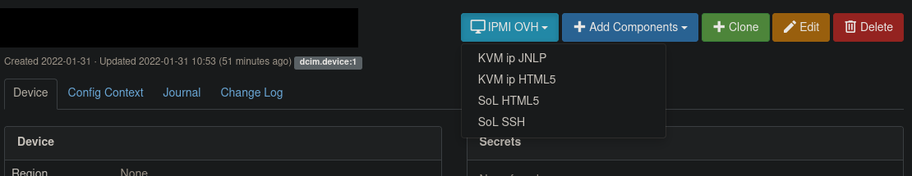
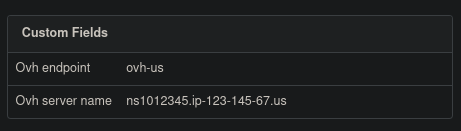

# Netbox IPMI OVH Plugin

A plugin used to add a button in the dcim.device to allow easier access to the IPMI for OVH managed bare metal servers.
Tested on NetBox v2.11.12, v3.0.0 and v3.1.7.

# Installation
This follow the process of installing a plugin in NetBox [https://netbox.readthedocs.io/en/stable/plugins/]

### Package Installation from PyPi, from the netbox virtualenv

```
source /opt/netbox/venv/bin/activate
pip install netbox-ipmi-ovh
cd /opt/netbox/netbox/
python3 manage.py migrate
```

### Package Installation from source

```
git clone https://github.com/sanecz/netbox-ipmi-ovh
cd netbox-ipmi-ovh
source /opt/netbox/venv/bin/activate
pip3 install .
cd /opt/netbox/netbox/
python3 manage.py migrate
```

### Enable the plugin
To enable the plugin, add/update in the **configuration.py** file

```python
PLUGINS = [
    'netbox_ipmi_ovh',
]
```

```python
PLUGINS_CONFIG = {
    'netbox_ipmi_ovh': {
        'ovh_server_name_field': 'existing field or custom field',
	'ovh_endpoint_field': 'existing or custom field',
        'endpoints': {
            'account1-ovh-eu': {
	        'endpoint': 'ovh-eu',
	        'application_key': 'xxxx',
		'application_secret': 'yyyy',
		'consumer_key': 'zzzz'
	    },
	    'account2-soyoustart-ca': {
	        'endpoint': 'soyoustart-ca',
	        'application_key': 'xxxx',
		'application_secret': 'yyyy',
		'consumer_key': 'zzzz'	    
	    }
        }
    }
}
```

The fields **ovh_server_name_field**, **ovh_endpoint_field** and **endpoints** are mandatory.

### Restart Netbox
```
sudo systemctl restart netbox
```

### Required permissions

To be able to use the plugin, a user should have the following permissions:
- netbox_ipmi_ovh.view_ipmi

# Usage

A button will be present in dcim.devices to select the type of IPMI access you want to use. As of 01/02/2022, only kvmipHtml5URL, kvmipJnlp, serialOverLanURL and serialOverLanSshKey are available.



You can create custom fields to store required informations for the plugin to work (i.e the server name from OVH and the endpoint used for the api calls) or use existing fields (like asset tag or serial number or the name), but be careful to fill correctly **ovh_endpoint_field** and **ovh_server_name_field** with the name of the fields you want to use, there is no default value.



